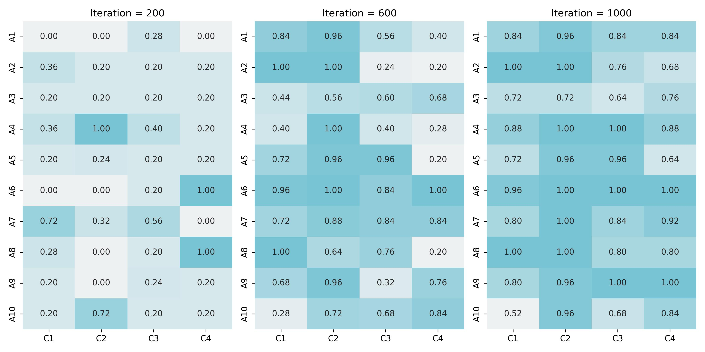

# Replication of Rainbow Teaming: Open-Ended Generation of Diverse Adversarial Prompts

This repository contains a replication of the paper:
> Samvelyan, Mikayel, et al. "Rainbow teaming: Open-ended generation of diverse adversarial prompts." *arXiv preprint arXiv:2402.16822* (2024).

## Repository Overview
While the original paper outlines the algorithm, the Large Language Model prompts in this repository (see template_rainbow.py) are my original contributions.

The figure below presents an overview of safety score updates across different iterations:


## Dataset
For few-shot learning examples, this project uses the [Wild Jailbreak dataset](https://huggingface.co/datasets/allenai/wildjailbreak), a publicly available dataset designed for adversarial robustness testing.

## Execution
```bash
git clone https://github.com/jean-jsj/rainbow-teaming-kr.git
cd rainbow-teaming-kr
pip install -r requirements.txt
python main.py
```

> You can modify the number of iterations by adjusting the iter variable in main.py.
> The script utilizes OpenAI's GPT-4o Mini and GPT-3.5 Turbo.
> Running this code incurs an estimated cost of $3.97 per 1,000 iterations.

## Citation
If you find the LLM prompts from this repository useful, please cite it with:
@misc{Hong2025Rainbow,
  author = {Juwon Hong},
  title = {Replication of Rainbow Teaming: 'Rainbow Teaming: Open-Ended Generation of Diverse Adversarial Prompts'},
  year = {2025},
  url = {https://github.com/jean-jsj/rainbow-teaming-kr}
}
